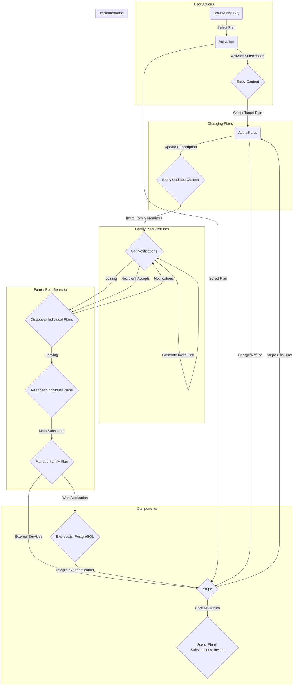

**Overview**

This subscription service lets you access special content through three plans: Science, Guide, and Family.

**Plans**

1. **Science Plan:**
    
    * Basic plan for accessing important content.
2. **Guide Plan:**
    
    * Extra services along with Science benefits.
3. **Family Plan:**
    
    * Discounted access for up to 5 family members.

**What You Can Do**

* **Browse and Buy:**
    
    * Look at different plans and choose one that suits you.
* **Activation:**
    
    * Click a link to start using your chosen plan.
* **Changing Plans:**
    
    * Switch plans based on some rules.
* **Family Plan Features:**
    
    * Invite family members and get notifications.

**Family Plan Behavior**

* **Joining:**
    
    * Individual plans disappear, only family plan is visible.
* **Leaving:**
    
    * Individual plans come back, goes back to the old plan.
* **Main Subscriber:**
    
    * The main person in the family can control the family plan.

**Components**

* **Web Application:**
    
    * Where you pick and buy plans, made with Express.js and PostgreSQL.
* **External Services:**
    
    * Zammad for checking who you are.
    * Stripe for paying the bill.
* **Important Stuff Stored**
    
    * **Users:**
        
        * Keeps your details.
    * **Plans:**
        
        * Has info about different plans.
    * **Subscriptions:**
        
        * Links you to the plan you chose.
    * **Invites:**
        
        * Deals with family plan invitations.

**How It Works**

* **Log In:**
    
    * Use Zammad to prove who you are.
* **Buying:**
    
    * Pick a plan, pay with Stripe, and start using it.
* **Changing Plans:**
    
    * Check the plan details, follow the rules, and switch plans.
* **Family Invitations:**
    
    * Family leader sends a link, family member clicks it, and everyone gets notified when someone joins or leaves.
