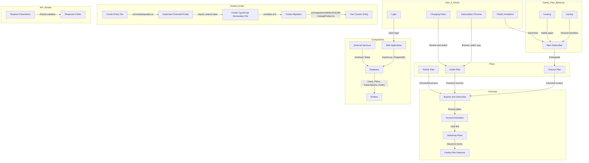

**Overview**

Unlock exclusive content with our subscription service, offering three distinct plans: Science, Guide, and Family.

**Plans**

1. **Science Plan:**
    
    * Essential content.
2. **Guide Plan:**
    
    * Premium content.
3. **Family Plan:**
    
    * Premium content discounted access for up to 5 family members to Guide plans.

**What You Can Do**

* **Explore and Subscribe:**
    
    * Browse the 3 plans and choose the one that aligns with your preferences, upgrading or downgrading.
* **Account Activation:**
    
    * Activate your Guide plan effortlessly by clicking on the sent link post-subscription.
* **Switching Plans:**
    
    * Seamlessly transition between plans based on specified terms and conditions.
* **Family Plan Features:**
    
    * Invite family members to receive a dependant upgrade.

**Family Plan Behavior**

* **Joining:**
    
    * Family members when accepted in the family plan, have their plan page discreetly transition to a shared family plan page, visible exclusively to dependents.
* **Leaving:**
    
    * Personal plans become visible again if user is removed from the family plan.
* **Main Subscriber:**
    
    * The main subscriber with control over the family plan and membership. They can downgrade, reverting all members to individual basic plans.

**Components**

* **Web Application:**
    
    * Medusa.js for a seamless experience in managing subscriptions and payments.

**How It Works**

* **Login:**
    
    * Access plans and subscriptions seamlessly upon login, exclusive to Basic plan users.
* **Subscription Process:**
    
    * Browse plans, select, pay, and activate your chosen plan hassle-free.
* **Changing Plans:**
    
    * Review plan details and effortlessly switch plans based on predefined terms and conditions.
* **Family Invitations:**
    
    * Family leaders send personalized links to members; upon acceptance, members seamlessly integrate into the family plan as dependents.
